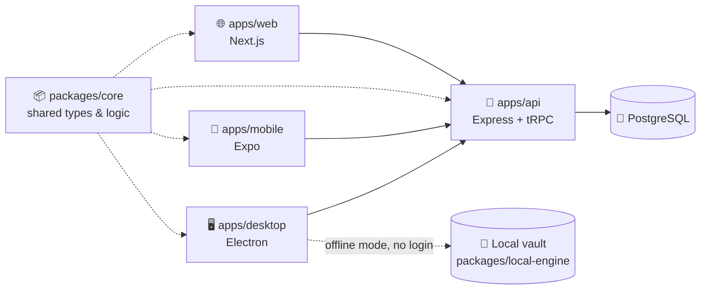
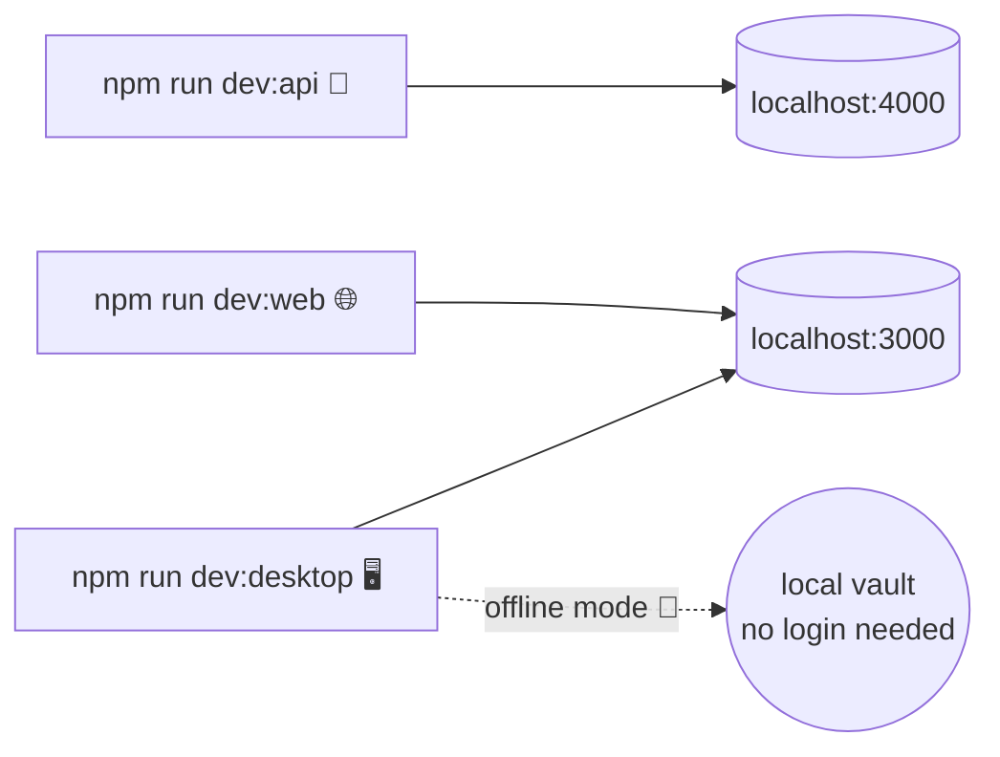

# 🗃️ Simplekasten

> Turn scattered notes into a living network of atomic, permanently linked ideas.

Simplekasten is a **Zettelkasten**-based memory management app. It takes Niklas Luhmann's slip-box method — atomic notes 🧩, permanent IDs 🔖, deliberate links 🔗 — and pairs it with modern search 🔍 and a graph view 🕸️, so your notes become a network you *think with*, not an archive you write into and never revisit.

📖 [DEVELOPMENT_PLAN.md](./DEVELOPMENT_PLAN.md) · 🛠️ [IMPLEMENTATION_PLAN.md](./IMPLEMENTATION_PLAN.md) · 🔌 [REST_API.md](./REST_API.md)

## ✨ Why Simplekasten?

| Most note apps... | Simplekasten... |
|---|---|
| 📥 optimize for *capture* | 🔁 optimizes for *retrieval* |
| 📁 bury notes in folders | 🕸️ links notes into a graph |
| 🏷️ tag once, forget forever | 🔗 resurfaces connections between ideas |
| 🔒 lock you into their format | 📤 exports to plain markdown, always |

## 🧭 How it fits together



Every client talks to one standalone API service — that's what keeps the note graph consistent as your vault grows. 🖥️ Desktop is special: it can also run **fully offline with no login**, powered by its own local-first vault engine. 🎉

## 🗂️ Project layout

This is an **npm workspaces monorepo**:

- `apps/web` — 🌐 Next.js frontend
- `apps/api` — 🚀 Express + tRPC API service (Prisma/PostgreSQL)
- `apps/desktop` — 🖥️ Electron shell wrapping the web app, with an offline-first local vault engine
- `apps/mobile` — 📱 React Native (Expo) app
- `packages/core` — 📦 shared types, schemas, and note/link logic used across apps
- `packages/db` — 🐘 Prisma schema and database client
- `packages/local-engine` — 💾 local-first vault engine that lets the desktop app work fully offline
- `e2e` — 🧪 end-to-end tests

## ⚙️ Requirements

- 🟢 Node.js >= 22
- 🐳 Docker (for a local PostgreSQL instance), or an existing PostgreSQL database

## 🚀 Setup

```bash
npm install
```

Spin up the database:

```bash
docker compose up -d
cp apps/api/.env.example apps/api/.env
npm run db:generate
npm run db:migrate
```

Point the web app at the API:

```bash
cp apps/web/.env.example apps/web/.env
```

## 💻 Development



```bash
npm run dev:api       # 🚀 API on http://localhost:4000
npm run dev:web       # 🌐 Web app on http://localhost:3000
npm run dev:desktop   # 🖥️ Electron shell (wraps the web dev server)
```

💾 The desktop app can also run fully offline with no login, backed by its local vault engine — see [apps/desktop/README.md](./apps/desktop/README.md).

📱 For mobile, see [apps/mobile/README.md](./apps/mobile/README.md).

## ✅ Testing & checks

```bash
npm run typecheck           # 🔎 types
npm run test                 # 🧪 unit tests
npm run test:integration     # 🔗 API integration tests
npm run test:e2e             # 🎭 end-to-end tests
```

## 📦 Build

```bash
npm run build
```

---

🧠 Built for people who'd rather *think* with their notes than just *store* them.
