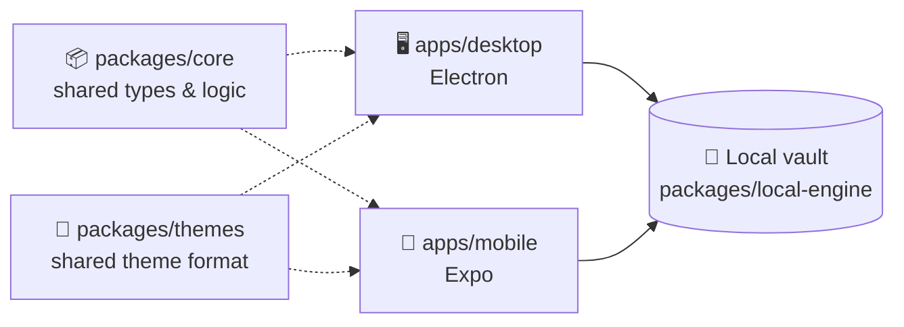

# 🗃️ Simplekasten

> Turn scattered notes into a living network of atomic, permanently linked ideas.

Simplekasten is a **Zettelkasten**-based memory management app. It takes Niklas Luhmann's slip-box method — atomic notes 🧩, permanent IDs 🔖, deliberate links 🔗 — and pairs it with modern search 🔍 and a graph view 🕸️, so your notes become a network you *think with*, not an archive you write into and never revisit.

## ✨ Why Simplekasten?

| Most note apps... | Simplekasten... |
|---|---|
| 📥 optimize for *capture* | 🔁 optimizes for *retrieval* |
| 📁 bury notes in folders | 🕸️ links notes into a graph |
| 🏷️ tag once, forget forever | 🔗 resurfaces connections between ideas |
| 🔒 lock you into their format | 📤 exports to plain markdown, always |

## 🧭 How it fits together



Simplekasten is **fully local**: no account, no network calls, no server, no web app. Desktop and Mobile each read and write the vault as plain markdown files with YAML frontmatter directly on disk, via the shared `packages/local-engine`. 🎉

## 🗂️ Project layout

This is an **npm workspaces monorepo**:

- `apps/desktop` — 🖥️ Electron app — reads/writes the vault as markdown files via `packages/local-engine`, no login
- `apps/mobile` — 📱 React Native (Expo) app — same `packages/local-engine`, via an Expo file-system adapter, no login
- `packages/core` — 📦 shared types, schemas, and note/link logic used across apps
- `packages/local-engine` — 💾 local-first vault engine powering both the desktop and mobile apps
- `packages/themes` — 🎨 shared theme format, built-in themes (Memphis, Classic) and install/list/remove helpers used by both apps

## ⚙️ Requirements

- 🟢 Node.js >= 22

## 🚀 Setup

```bash
npm install
```

Both apps work fully offline out of the box — there's nothing else to set up.

## 💻 Development

```bash
npm run dev:desktop   # 🖥️ Electron app — fully local, no login, no network
npm run dev:mobile    # 📱 Expo app — fully local, no login, no network
```

💾 The desktop app is fully local, backed by its local vault engine — see [apps/desktop/README.md](./apps/desktop/README.md).

📱 For mobile, see [apps/mobile/README.md](./apps/mobile/README.md).

## 🎨 Themes

Desktop and mobile share one theme format. A theme is a single **JSON file** — inert data, never code — that controls colours (light and dark), shape (border width, corner radius, an optional hard offset shadow) and font. Two themes ship built in: **Memphis** (the default) and **Classic** (the original slate-and-emerald look, thin borders, rounded corners).

**Memphis** is built on a five-colour palette, with heavy 3px borders, square corners and a blur-free teal offset shadow in both modes:

| | Colour | Hex | Where it shows up |
|---|---|---|---|
| 🟣 | Purple | `#672394` | link and hover colour (light), base of the ink and the dark background |
| 🩷 | Pink | `#f725a0` | accent — primary buttons, selected note |
| 🟡 | Yellow | `#fad141` | borders in dark mode, chips in light mode |
| 🩵 | Teal | `#0cb2c0` | offset shadow, second accent in dark mode |
| 🤍 | Cream | `#e8e6d9` | light-mode background, dark-mode text |

Light mode is a cream ground with purple-black ink and borders; dark mode is a deep-purple ground with cream ink and yellow borders. The desktop app ships the same tokens as CSS fallbacks so the first paint is already Memphis (no flash before the saved theme loads); a unit test keeps them in sync with the theme definition. All UI colours come from the active theme — including the graph view — so nothing is hard-coded to one palette.

**Switching and installing:** open **Settings** (the ⚙ in the desktop sidebar, or in the mobile vault header). Pick a theme, choose System / Light / Dark, and use **Install theme…** to import a `.json` file (or **Paste JSON**). Errors are shown inline with the offending field path.

**Default:** Memphis is used when nothing is saved, and whenever the saved theme can't be loaded.

**Where they live:** installed themes are saved in your vault as `<vault>/themes/<id>.json`, so they travel with it. There's no device-to-device sync yet — install the file on each device, or copy the vault folder. Your chosen theme and mode are stored in each app's own `settings.json`. If a saved theme can no longer be loaded, the app falls back to Memphis and flags it in Settings.

**Writing your own:**

```json
{
  "schemaVersion": 1,
  "id": "sunset",
  "name": "Sunset",
  "author": "you",
  "colors": {
    "light": { "bg": "#fff4d6", "surface": "#ffffff", "surface2": "#ffe8a3", "ink": "#111111", "inkMuted": "#3b3b3b", "inkFaint": "#6b6b6b", "line": "#111111", "lineSoft": "#e6d9b0", "accent": "#e6007e", "accentInk": "#a3005a", "accentSoft": "#ffd6ec", "accent2": "#007f73", "accent2Soft": "#c9f5ef", "danger": "#d62828", "dangerSoft": "#ffdada" }
  },
  "shape": { "borderWidth": 3, "radius": 0, "shadow": { "x": 4, "y": 4, "color": "#ff3ea5" } },
  "font": { "display": "rounded-bold", "body": "sans", "mono": "mono" }
}
```

- `colors.light` is required. `colors.dark` is optional (same 15 keys); without it the light palette is also used in dark mode.
- All 15 colour keys are required in each palette you provide, as `#rgb` or `#rrggbb`.
- `borderWidth` 0–6, `radius` 0–24, `shadow` `x`/`y` 0–16 (`shadow` is optional).
- `font` values are keywords: `sans`, `rounded-bold`, `serif`, `mono`.
- `id` is 1–40 characters of `a-z`, `0-9`, `-`. `memphis` and `classic` are reserved. Imported files over 256 KB are rejected.
- Unknown keys are rejected, so typos surface as errors instead of being silently ignored.

The design is in [docs/superpowers/specs/2026-09-19-installable-themes-design.md](./docs/superpowers/specs/2026-09-19-installable-themes-design.md).

## 🔗 Linking notes

Link notes with `[[Note Title]]` (or `[[Note Title|alias]]`). Links resolve by title, case-insensitively, and the target's **Linked mentions** panel lists every note that points at it. Note titles can't contain `[[` or `]]` — they're stripped on save, because a title like `Foo [[Bar]]` could never be linked to.

## ✅ Testing & checks

```bash
npm run typecheck                          # 🔎 types
npm run test                               # 🧪 unit tests
npm run test:e2e -w @simplekasten/desktop  # 🎭 Playwright browser tests (desktop UI + themes)
```

The Playwright suite (`apps/desktop/e2e`) runs the real renderer against a stubbed Electron bridge — no Electron process or real vault needed. It checks Memphis in light and dark, that it is the default (including a JavaScript-off first paint), that every colour painted on screen comes from the palette, and that Classic still works. First run: `npx playwright install chromium` inside `apps/desktop`. Screenshots and traces go to `test-results/` (gitignored).

## 📦 Build

```bash
npm run build
```

---

🧠 Built for people who'd rather *think* with their notes than just *store* them.
