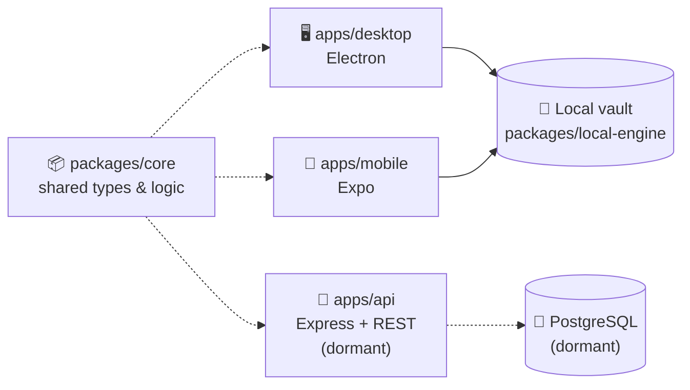
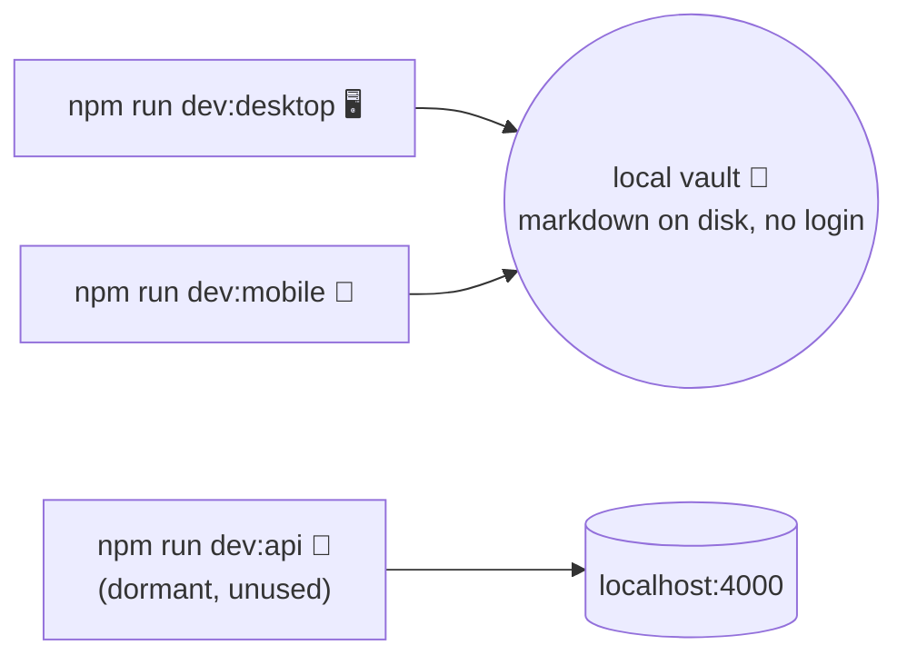

# 🗃️ Simplekasten

> Turn scattered notes into a living network of atomic, permanently linked ideas.

Simplekasten is a **Zettelkasten**-based memory management app. It takes Niklas Luhmann's slip-box method — atomic notes 🧩, permanent IDs 🔖, deliberate links 🔗 — and pairs it with modern search 🔍 and a graph view 🕸️, so your notes become a network you *think with*, not an archive you write into and never revisit.

📖 [DEVELOPMENT_PLAN.md](./DEVELOPMENT_PLAN.md) · 🛠️ [IMPLEMENTATION_PLAN.md](./IMPLEMENTATION_PLAN.md) · 🔌 [REST_API.md](./REST_API.md)

## ✨ Why Simplekasten?

| Most note apps... | Simplekasten... |
|---|---|
| 📥 optimize for *capture* | 🔁 optimizes for *retrieval* |
| 📁 bury notes in folders | 🕸️ links notes into a graph |
| 🏷️ tag once, forget forever | 🔗 resurfaces connections between ideas |
| 🔒 lock you into their format | 📤 exports to plain markdown, always |

## 🧭 How it fits together



Desktop and Mobile are both **fully local**: no account, no network calls, no server. Each reads and writes the vault as plain markdown files with YAML frontmatter directly on disk, via the shared `packages/local-engine`. 🎉 `apps/api` (Express + REST) and `packages/db` (Prisma/PostgreSQL) remain in the repo but are currently **dormant** — no client uses them — kept as the future home of an opt-in cross-device sync feature.

## 🗂️ Project layout

This is an **npm workspaces monorepo**:

- `apps/api` — 🚀 Express + REST API service (Prisma/PostgreSQL) — dormant, not called by any client today
- `apps/desktop` — 🖥️ Electron app, fully local — reads/writes the vault as markdown files via `packages/local-engine`, no login
- `apps/mobile` — 📱 React Native (Expo) app, fully local — same `packages/local-engine`, via an Expo file-system adapter, no login
- `packages/core` — 📦 shared types, schemas, and note/link logic used across apps
- `packages/db` — 🐘 Prisma schema and database client — dormant, only used by the dormant `apps/api`
- `packages/local-engine` — 💾 local-first vault engine powering both the desktop and mobile apps
- `packages/themes` — 🎨 shared theme format, built-in themes (Memphis, Classic) and install/list/remove helpers used by both apps

## ⚙️ Requirements

- 🟢 Node.js >= 22
- 🐳 Docker (optional — only needed if you're working on the dormant `apps/api` service; not required to run desktop or mobile)

## 🚀 Setup

```bash
npm install
```

That's it for desktop and mobile — both work fully offline out of the box.

If you're working on the dormant `apps/api` service, spin up its database too:

```bash
docker compose up -d
cp apps/api/.env.example apps/api/.env
npm run db:generate
npm run db:migrate
```

## 💻 Development



```bash
npm run dev:desktop   # 🖥️ Electron app — fully local, no login, no network
npm run dev:mobile    # 📱 Expo app — fully local, no login, no network
npm run dev:api       # 🚀 dormant API service (no client calls it today)
```

💾 The desktop app is fully local, backed by its local vault engine — see [apps/desktop/README.md](./apps/desktop/README.md).

📱 For mobile, see [apps/mobile/README.md](./apps/mobile/README.md).

## 🎨 Themes

Desktop and mobile share one theme format. A theme is a single **JSON file** — inert data, never code — that controls colours (light and dark), shape (border width, corner radius, an optional hard offset shadow) and font. Two themes ship built in: **Memphis** (the default — a purple/pink/yellow/teal/cream palette, cream ground in light mode and deep purple in dark, heavy borders, square corners, a blur-free teal shadow) and **Classic** (the original slate-and-emerald look).

**Switching and installing:** open **Settings** (the ⚙ in the desktop sidebar, or in the mobile vault header). Pick a theme, choose System / Light / Dark, and use **Install theme…** to import a `.json` file (or **Paste JSON**). Errors are shown inline with the offending field path.

**Where they live:** installed themes are saved in your vault as `<vault>/themes/<id>.json`, so they travel with it. There's no device-to-device sync yet — install the file on each device, or copy the vault folder. Your chosen theme and mode are stored in each app's own `settings.json`. If a saved theme can no longer be loaded, the app falls back to Memphis and flags it in Settings.

**Writing your own:**

```json
{
  "schemaVersion": 1,
  "id": "sunset",
  "name": "Sunset",
  "author": "you",
  "colors": {
    "light": { "bg": "#fff4d6", "surface": "#ffffff", "surface2": "#ffe8a3", "ink": "#111111", "inkMuted": "#3b3b3b", "inkFaint": "#6b6b6b", "line": "#111111", "lineSoft": "#e6d9b0", "accent": "#e6007e", "accentInk": "#a3005a", "accentSoft": "#ffd6ec", "accent2": "#007f73", "accent2Soft": "#c9f5ef", "danger": "#d62828", "dangerSoft": "#ffdada" }
  },
  "shape": { "borderWidth": 3, "radius": 0, "shadow": { "x": 4, "y": 4, "color": "#ff3ea5" } },
  "font": { "display": "rounded-bold", "body": "sans", "mono": "mono" }
}
```

- `colors.light` is required. `colors.dark` is optional (same 15 keys); without it the light palette is also used in dark mode.
- All 15 colour keys are required in each palette you provide, as `#rgb` or `#rrggbb`.
- `borderWidth` 0–6, `radius` 0–24, `shadow` `x`/`y` 0–16 (`shadow` is optional).
- `font` values are keywords: `sans`, `rounded-bold`, `serif`, `mono`.
- `id` is 1–40 characters of `a-z`, `0-9`, `-`. `default` and `memphis` are reserved. Imported files over 256 KB are rejected.
- Unknown keys are rejected, so typos surface as errors instead of being silently ignored.

The design is in [docs/superpowers/specs/2026-09-19-installable-themes-design.md](./docs/superpowers/specs/2026-09-19-installable-themes-design.md).

## ✅ Testing & checks

```bash
npm run typecheck           # 🔎 types
npm run test                 # 🧪 unit tests
npm run test:integration     # 🔗 API integration tests
```

## 📦 Build

```bash
npm run build
```

---

🧠 Built for people who'd rather *think* with their notes than just *store* them.
