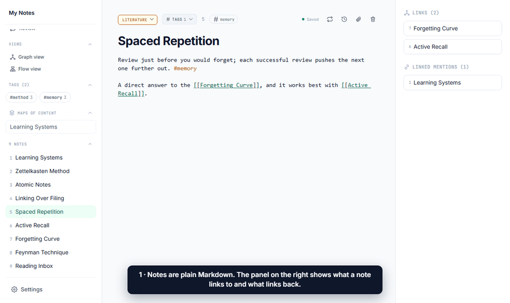
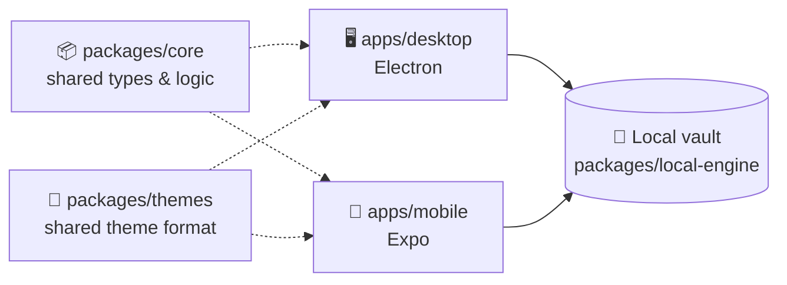

# 🗃️ Simplekasten

> Turn scattered notes into a living network of atomic, permanently linked ideas.

Simplekasten is a **Zettelkasten**-based memory management app. It takes Niklas Luhmann's slip-box method — atomic notes 🧩, permanent IDs 🔖, deliberate links 🔗 — and pairs it with modern search 🔍 and a graph view 🕸️, so your notes become a network you *think with*, not an archive you write into and never revisit.

## ✨ Why Simplekasten?

| Most note apps... | Simplekasten... |
|---|---|
| 📥 optimize for *capture* | 🔁 optimizes for *retrieval* |
| 📁 bury notes in folders | 🕸️ links notes into a graph |
| 🏷️ tag once, forget forever | 🔗 resurfaces connections between ideas |
| 🔒 lock you into their format | 📤 exports to plain markdown, always |

## ⬇️ Download

| Your computer | Download |
|---|---|
| 🪟 Windows | [Simplekasten-Windows-Setup.exe](https://github.com/sunil3092/Simplekasten/releases/latest/download/Simplekasten-Windows-Setup.exe) |
| 🍎 Mac with Apple silicon (M1 and later) | [Simplekasten-macOS-Apple-Silicon.dmg](https://github.com/sunil3092/Simplekasten/releases/latest/download/Simplekasten-macOS-Apple-Silicon.dmg) |
| 🍎 Mac with an Intel chip | [Simplekasten-macOS-Intel.dmg](https://github.com/sunil3092/Simplekasten/releases/latest/download/Simplekasten-macOS-Intel.dmg) |

These links always fetch the newest release; older versions are on the [releases page](https://github.com/sunil3092/Simplekasten/releases). The installers aren't code-signed yet, so the first launch needs one extra step:

- **Windows:** if SmartScreen says the publisher is unknown, choose **More info → Run anyway**.
- **Mac:** right-click the app and choose **Open** the first time. If macOS says the app is damaged, run `xattr -cr /Applications/Simplekasten.app` in Terminal and open it again.

## 🎬 Quick tour



The walkthrough above runs through the desktop app. To follow along yourself:

1. **Start it.** `npm install`, then `npm run dev:desktop`. The first launch opens an empty vault; **Settings → Vault → Choose vault folder…** points it at any folder you like.
2. **Write a note.** **New note** creates one. Notes are Markdown, and they save as you type.
3. **Link and tag as you write.** Type `[[` to link another note or `#` to reuse a tag; both suggest as you type. The panel on the right lists what the note links to and what links back.
4. **Jump around.** `Ctrl/Cmd+K` opens the quick switcher. Type a title to open a note, or start with `>` to run a command.
5. **Filter by tag.** Click a tag in the sidebar to narrow the note list. Every sidebar section folds away from its heading.
6. **Keep a journal.** **Today** (`Ctrl/Cmd+J`) opens the day's journal note. Journal notes are tagged `#journalentry` automatically.
7. **See the network.** **Graph view** shows the vault as linked dots.
8. **Follow a line of thought.** **Flow view** lays the same notes out top to bottom by their links. Filter it by tag to follow one branch, drag cards by their header, and write, retype, create or delete notes right on the cards.
9. **Review.** Add a note to the review queue from its header, and **Review** resurfaces it on a spaced schedule.
10. **Make it yours.** **Settings** holds the vault folder, the theme, and light or dark mode.

The GIF is generated from the real UI: `npm run demo -w @simplekasten/desktop` rebuilds it after a UI change.

## 🧭 How it fits together


```mermaid
graph LR
    Desktop["🖥️ apps/desktop<br/>Electron"]
    Mobile["📱 apps/mobile<br/>Expo"]
    Local[("💾 Local vault<br/>packages/local-engine")]
    Core["📦 packages/core<br/>shared types & logic"]
    Themes["🎨 packages/themes<br/>shared theme format"]

    Desktop --> Local
    Mobile --> Local
    Core -.-> Desktop
    Core -.-> Mobile
    Themes -.-> Desktop
    Themes -.-> Mobile
```

Simplekasten is **fully local**: no account, no network calls, no server, no web app. Desktop and Mobile each read and write the vault as plain markdown files with YAML frontmatter directly on disk, via the shared `packages/local-engine`. 🎉

## 🗂️ Project layout

This is an **npm workspaces monorepo**:

- `apps/desktop` — 🖥️ Electron app — reads/writes the vault as markdown files via `packages/local-engine`, no login
- `apps/mobile` — 📱 React Native (Expo) app — same `packages/local-engine`, via an Expo file-system adapter, no login
- `packages/core` — 📦 shared types, schemas, and note/link logic used across apps
- `packages/local-engine` — 💾 local-first vault engine powering both the desktop and mobile apps
- `packages/themes` — 🎨 shared theme format, built-in themes (Classic, Memphis, SnowUI) and install/list/remove helpers used by both apps

## ⚙️ Requirements

- 🟢 Node.js >= 22

## 🚀 Setup

```bash
npm install
```

Both apps work fully offline out of the box — there's nothing else to set up.

## 💻 Development

```bash
npm run dev:desktop   # 🖥️ Electron app — fully local, no login, no network
npm run dev:mobile    # 📱 Expo app — fully local, no login, no network
```

💾 The desktop app is fully local, backed by its local vault engine — see [apps/desktop/README.md](./apps/desktop/README.md).

📱 For mobile, see [apps/mobile/README.md](./apps/mobile/README.md).

## 🎨 Themes

Desktop and mobile share one theme format. A theme is a single **JSON file** — inert data, never code — that controls colours (light and dark), shape (border width, corner radius, an optional hard offset shadow) and font.

Three themes ship built in:

| Theme | Look |
|---|---|
| **Classic** (default) | Slate and emerald, thin 1px borders, rounded corners, no hard shadow. |
| **Memphis** | Purple, pink, yellow, teal and cream, with heavy 3px borders, square corners and a blur-free teal offset shadow. |
| **SnowUI** | A quiet green, sage and cream palette with Classic's thin borders and rounded corners. |

**Default:** Classic is used when nothing is saved, and whenever the saved theme can't be loaded. The desktop app also ships Classic's tokens as CSS fallbacks, so the first paint is already themed (no flash before the saved theme loads); a unit test keeps them in sync with the theme definition. All UI colours come from the active theme — including the graph and flow views — so nothing is hard-coded to one palette.

**Switching and installing:** open **Settings** (at the bottom of the desktop sidebar, or in the mobile vault header). Pick a theme, choose System / Light / Dark, and use **Install theme…** to import a `.json` file (or **Paste JSON**). Errors are shown inline with the offending field path.

**Where they live:** installed themes are saved in your vault as `<vault>/themes/<id>.json`, so they travel with it. There's no device-to-device sync yet — install the file on each device, or copy the vault folder. Your chosen theme and mode are stored in each app's own `settings.json`. If a saved theme can no longer be loaded, the app falls back to Classic and flags it in Settings.

**Writing your own:**

```json
{
  "schemaVersion": 1,
  "id": "sunset",
  "name": "Sunset",
  "author": "you",
  "colors": {
    "light": { "bg": "#fff4d6", "surface": "#ffffff", "surface2": "#ffe8a3", "ink": "#111111", "inkMuted": "#3b3b3b", "inkFaint": "#6b6b6b", "line": "#111111", "lineSoft": "#e6d9b0", "accent": "#e6007e", "accentInk": "#a3005a", "accentSoft": "#ffd6ec", "accent2": "#007f73", "accent2Soft": "#c9f5ef", "danger": "#d62828", "dangerSoft": "#ffdada" }
  },
  "shape": { "borderWidth": 3, "radius": 0, "shadow": { "x": 4, "y": 4, "color": "#ff3ea5" } },
  "font": { "display": "rounded-bold", "body": "sans", "mono": "mono" }
}
```

- `colors.light` is required. `colors.dark` is optional (same 15 keys); without it the light palette is also used in dark mode.
- All 15 colour keys are required in each palette you provide, as `#rgb` or `#rrggbb`.
- `borderWidth` 0–6, `radius` 0–24, `shadow` `x`/`y` 0–16 (`shadow` is optional).
- `font` values are keywords: `sans`, `rounded-bold`, `serif`, `mono`.
- `id` is 1–40 characters of `a-z`, `0-9`, `-`. `memphis`, `classic` and `snowui` are reserved. Imported files over 256 KB are rejected.
- Unknown keys are rejected, so typos surface as errors instead of being silently ignored.

The design is in [docs/superpowers/specs/2026-09-19-installable-themes-design.md](./docs/superpowers/specs/2026-09-19-installable-themes-design.md).

## 🔗 Linking notes

Link notes with `[[Note Title]]` (or `[[Note Title|alias]]`). Links resolve by title, case-insensitively, and the target's **Linked mentions** panel lists every note that points at it. Note titles can't contain `[[` or `]]` — they're stripped on save, because a title like `Foo [[Bar]]` could never be linked to.

## 🏷️ Tags

Tags are optional. Write `#tag` anywhere in a note, or use the **Tags** dropdown in the note header (a sheet on mobile) to assign existing tags or create new ones without touching the text. Assigned tags are stored in the note's frontmatter as `tags:`, and only once a note has at least one. A note's tags are both kinds together: filtering, counts and the tag chips treat them the same. A tag that comes from a `#hashtag` shows as locked in the dropdown ("in text"), since removing it means editing the note. Tag names follow the hashtag rule: they start with a letter and use only letters, digits, `_`, `/` or `-`. They are stored in lowercase, so `#Idea` and `#idea` are the same tag.

Typing `#` in the desktop editor suggests the tags the vault already has, so the same tag gets reused instead of a near-duplicate.

**Journal notes** always carry the built-in `#journalentry` tag. It comes from the note being a journal (daily) note rather than from anything written or assigned, so it covers every journal entry, old and new, and shows as locked in the dropdown. Use it to pick journal entries out, in the note list or in Flow view.

## 🌊 Flow view

Flow view (desktop) reads the vault's links as a top-to-bottom diagram: a note that links to another sits above it, with an arrow down to the target. Cards arrange themselves and can be dragged by their header; arrows bend around cards rather than passing behind them. A tag search narrows the flow to the notes carrying any chosen tag (including **Untagged**), and a **Journal** toggle hides or shows journal entries. Notes are edited on the cards themselves, with the same `[[` and `#` suggestions as the main editor, and each card can change its note type, open in the editor, or be deleted. Details in [docs/features/flow-view.md](./docs/features/flow-view.md).

## ✅ Testing & checks

```bash
npm run typecheck                          # 🔎 types
npm run test                               # 🧪 unit tests
npm run test:e2e -w @simplekasten/desktop  # 🎭 Playwright browser tests (desktop UI + themes)
```

The Playwright suite (`apps/desktop/e2e`) runs the real renderer against a stubbed Electron bridge — no Electron process or real vault needed. It covers the sidebar, notes, links, tags, journal, templates, review, version history, canvas and flow view, and the themes: that Classic is the default (including a JavaScript-off first paint), and that under Memphis every colour painted on screen comes from the palette. First run: `npx playwright install chromium` inside `apps/desktop`. Screenshots and traces go to `test-results/` (gitignored).

## 🖼️ App icon

The icon (two linked slips from the slip-box, on a purple tile) is drawn once as SVG in `assets/icon/`, with a simplified version for 32px and below and a monochrome outline for Android themed icons. `npm run build:icons` renders every platform's file from those: desktop `icon.ico`, `icon.icns` and `icon.png`, and the mobile app icon, Android adaptive layers, splash and favicon. The outputs are committed, so re-run it only when the artwork changes.

## 📦 Build

```bash
npm run build                          # 🏗️ every workspace
npm run build -w @simplekasten/desktop  # 🖥️ installer only
```

The desktop build has three steps: the Next.js static export, an esbuild bundle of the Electron main process (`build:main`), and electron-builder. The bundle matters — at dev time `main.js` loads the engine's TypeScript through `tsx`, but a packaged app can't, because `tsx` spawns an esbuild binary that isn't in the package. Bundling ahead of time inlines the TypeScript instead, so the shipped app needs nothing from `node_modules`. `e2e/packaged-build.e2e.ts` launches the packaged app to prove it still boots; it skips when there's no build.

### 🚢 Releases

Pushing a branch named `release/<version>` builds the desktop app on GitHub and publishes the installers as a GitHub Release, where anyone can download them:

```bash
git checkout -b release/0.2.0
git push -u origin release/0.2.0
```

That produces the release `v0.2.0` with a Windows installer (`.exe`) and macOS disk images (`.dmg`, one for Apple silicon and one for Intel). The files are published under version-free names, which is what lets the Download links at the top of this README always point at the newest release. The version comes from the branch name and must look like `1.2.3` or `1.2.3-beta.1`. Typecheck and unit tests run first, and pushing to the same branch again rebuilds and replaces the release. The workflow is [.github/workflows/release.yml](./.github/workflows/release.yml).

The installers are not code-signed, so Windows SmartScreen and macOS Gatekeeper ask for confirmation on first launch; the release notes explain how to get past that. The macOS app carries an ad-hoc signature (`apps/desktop/scripts/adhoc-sign.js`), which Apple silicon Macs need before they will start an app at all.

---

🧠 Built for people who'd rather *think* with their notes than just *store* them.
